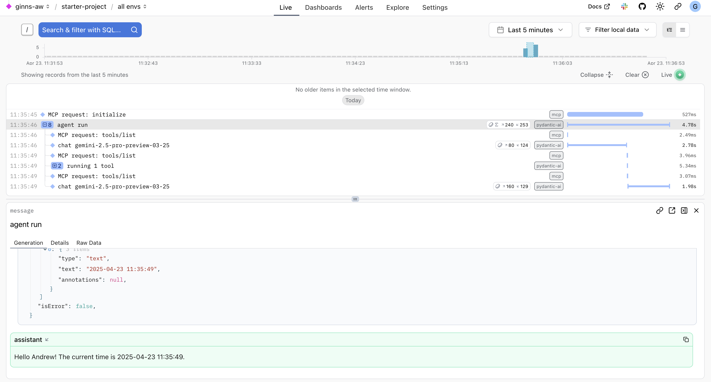

# Model Context Protocol (MCP) Agent Frameworks Demo

This repository demonstrates the usage of a simple Model Context Protocol (MCP) server with several frameworks:
- Google Agent Development Toolkit (ADK)
- LangGraph Agents
- OpenAI Agents
- Pydantic-AI Agents

Included MCP Server is based on [MCP Python SDK Quickstart](https://github.com/modelcontextprotocol/python-sdk/blob/b4c7db6a50a5c88bae1db5c1f7fba44d16eebc6e/README.md?plain=1#L104)
- Modified to include a datetime tool and run as a server invoked by Agents

Tracing is done through Pydantic Logfire.

# Quickstart

`cp .env.example .env`
- Add `GEMINI_API_KEY` and/or `OPENAI_API_KEY`
  - Individual scripts can be adjusted to use models from any provider supported by the specifi framework
    - By default only [basic_mcp_use/oai-agent_mcp.py](basic_mcp_use/oai-agent_mcp.py) requires `OPENAI_API_KEY`
    - All other scripts require `GEMINI_API_KEY`
- [Optional] Add `LOGFIRE_TOKEN` to visualise evaluations in Logfire web ui

Run an Agent framework script e.g.:
- `uv run basic_mcp_use/pydantic_mcp.py` - Requires `GEMINI_API_KEY` by default

- `uv run basic_mcp_use/oai-agent_mcp.py` - Requires `OPENAI_API_KEY` by default

Check console or Logfire for output

## Project Overview

This project aims to teach:
1. How to use MCP with multiple LLM Agent frameworks
    - Example MCP tools for adding numbers, getting current time
2. How to see traces LLM Agents with Logfire




## Repository Structure

- **basic_mcp_use/** - Contains basic examples of MCP usage:
  - `adk_mcp.py` - Example of using MCP with Google's Agent Development Kit (ADK)
  - `langgraph_mcp.py` - Example of using MCP with LangGraph
  - `oai-agent_mcp.py` - Examoke of using MCP with OpenAI Agents
  - `pydantic_mcp.py` - Example of using MCP with Pydantic-AI

- `run_server.py` - Simple MCP server that runs locally implemented in Python


## What is MCP?

The Model Context Protocol allows applications to provide context for LLMs in a standardised way, separating the concerns of providing context from the actual LLM interaction.

Learn more: https://modelcontextprotocol.io/introduction

## Why MCP

By defining clear specifications for components like resources (data exposure), prompts (reusable templates), tools (actions), and sampling (completions), MCP simplifies the development process and fosters consistency.

A key advantage highlighted is flexibility; MCP allows developers to more easily switch between different LLM providers without needing to completely overhaul their tool and data integrations. It provides a structured approach, potentially reducing the complexity often associated with custom tool implementations for different models. While frameworks like Google Agent Development Kit, LangGraph, OpenAI Agents, or libraries like PydanticAI facilitate agent building, MCP focuses specifically on standardising the interface between the agent's reasoning (the LLM) and its capabilities (tools and data), aiming to create a more interoperable ecosystem.

## Setup Instructions

1. Clone this repository
2. Install required packages:
   ```bash
   uv sync
   ```
3. Set up your environment variables in a `.env` file:
   ```
   LOGFIRE_TOKEN=your_logfire_token
   GEMINI_API_KEY=your_gemini_api_key
   OPENAI_API_KEY=your_openai_api_key
   ```
4. Run any of the sample scripts to see a simple MCP server being used via an Agent framework
- Google Agent Development Kit (ADK)
  - [basic_mcp_use/adk_mcp.py](basic_mcp_use/adk_mcp.py)
- LangGraph Agents
  - [basic_mcp_use/langgraph_mcp.py](basic_mcp_use/langgraph_mcp.py)
- OpenAI Agents
  - [basic_mcp_use/oai-agent_mcp.py](basic_mcp_use/oai-agent_mcp.py)
- Pydantic-AI Agents
  - [basic_mcp_use/pydantic_mcp.py](basic_mcp_use/pydantic_mcp.py)

## About Logfire

[Logfire](https://github.com/pydantic/logfire) is an observability platform from the team behind Pydantic that makes monitoring AI applications straightforward. Features include:

- Simple yet powerful dashboard
- Python-centric insights, including rich display of Python objects
- SQL-based querying of your application data
- OpenTelemetry support for leveraging existing tooling
- Pydantic integration for analytics on validations

Logfire gives you visibility into how your code is running, which is especially valuable for LLM applications where understanding model behavior is critical.